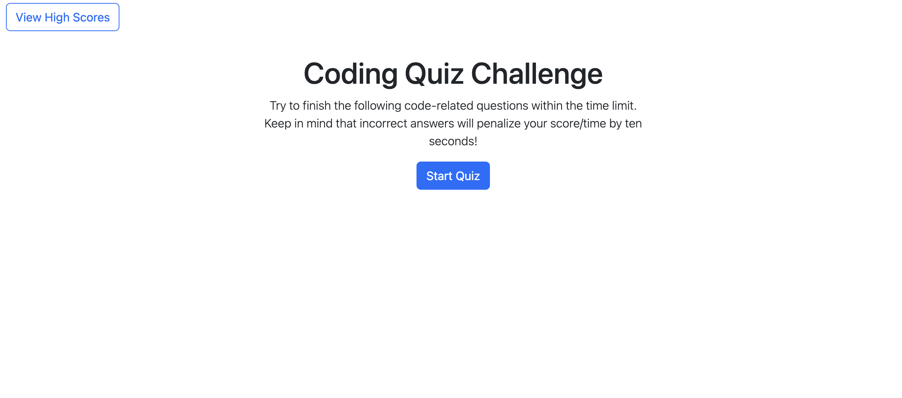
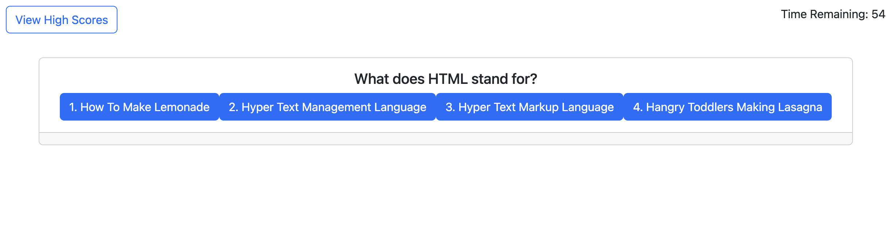

# JavaScript Quiz - Module 4 Challenge

## Overview
This web application is meant to serve as a simple quiz. The questions relate to various topics within web development. 

When the user selects a response to a question, the question and its answer buttons will update to a new question and answers. The current score will also update, and a message at the bottom will show whether or not the last answer was correct.

## Usage
Click the Start Quiz button to begin the quiz. When the quiz starts the timer will start in the top right corner.

Select your answer to the given question by clicking one of the buttons underneath the question.

## Screenshots

## Deployed Application Link
https://leucisticboi.github.io/JavaScriptQuiz/

## Installation
N/A

